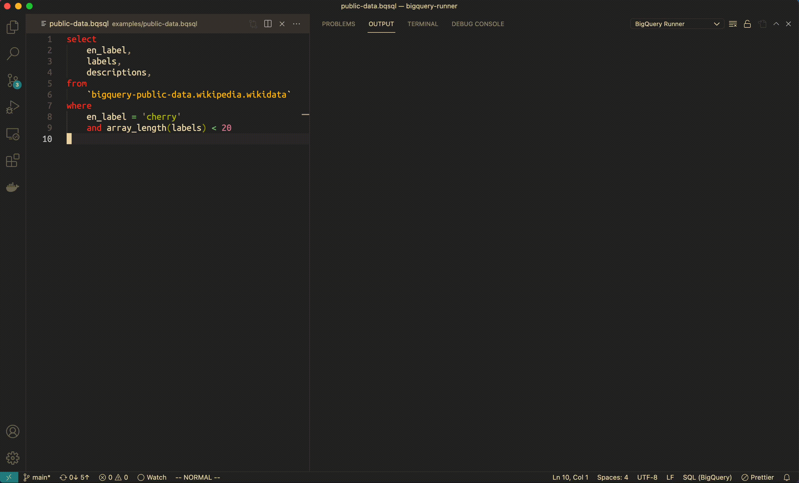
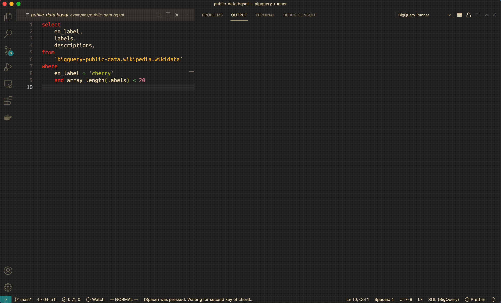
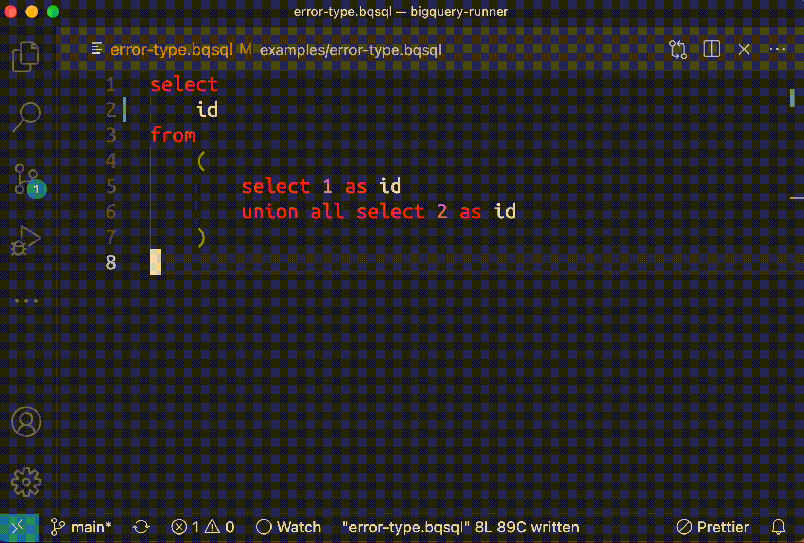

# BigQuery Runner for Visual Studio Code

A Visual Studio Code ("VS Code") extension that can query Google Cloud Platform's [BigQuery analytics database](https://cloud.google.com/bigquery/) from, and return results to, your editor. This extension allows you to:

- Write SQL in VS Code and query BigQuery datasets directly
- Create queries from selected text
- Capture results into VS Code window to manipulate them further
- Mark the location of errors encountered during the execution of a query job in the editor

This extension is great if you're exploring BigQuery and prefer VS Code's editing environment, or for cases where you're writing documentation (hint: use "Run selected text as query") and want to double check that the query is valid.

## Installing

[BigQuery Runner \- Visual Studio Marketplace](https://marketplace.visualstudio.com/items?itemName=minodisk.bigquery-runner)

## Usage

The BigQuery extension adds a number of commands to the command palette (Cmd/Ctrl+Shift+P).

By default, it will look for your `GOOGLE_APPLICATION_CREDENTIALS` environmental variable (if set) and use the service account described in that JSON file. You can also explicitly set `bigqueryRunner.keyFilename` to the path of your [Service Account key file](https://cloud.google.com/docs/authentication/getting-started). Unless necessary, it's recommended that you scope this key to the [`roles.bigquery.user`](https://cloud.google.com/bigquery/docs/access-control#permissions_and_roles) role, which is sufficient for querying and most related tasks.

## Commands

### `BigQuery Runner: Run`

- ID: `bigqueryRunner.run`

Run the query with BigQuery and display the results. Run the query on the selected text if text is selected, or on the entire file if no text is selected.



### `BigQuery Runner: Dry Run`

- ID: `bigqueryRunner.dryRun`

Run the dry run query with BigQuery and display the result. Run the query on the selected text if text is selected, or on the entire file if no text is selected.



## Configuration

The extension can be customized by modifying your `settings.json` file. The available configuration options, and their defaults, are below.

### `bigqueryRunner.keyFilename`

- **required**

Full path to the a .json, .pem, or .p12 key downloaded from the Google Developers Console. If you provide a path to a JSON file, the projectId option is not necessary. NOTE: .pem and .p12 require you to specify the email option as well.

### `bigqueryRunner.projectId`

The project ID from the Google Developer's Console, e.g. 'grape-spaceship-123'. This is NOT needed if you are provide a key in JSON format.

### `bigqueryRunner.location`

- default: `"US"`

The geographic location of the job. Required except for US and EU. See details at https://cloud.google.com/bigquery/docs/dataset-locations#specifying_your_location.

### `bigqueryRunner.useLegacySql`

- default: `false`

Specifies whether to use BigQuery's legacy SQL dialect for this query. The default value is true. If set to false, the query will use BigQuery's standard SQL: https://cloud.google.com/bigquery/sql-reference/

### `bigqueryRunner.maximumBytesBilled`

- default: `null`

Limits the bytes billed for this job. Queries that will have bytes billed beyond this limit will fail (without incurring a charge). If unspecified, this will be set to your project default.

### `bigqueryRunner.validateOnSave.enabled`

- default: `false`

If set to true, do a dry run on file save to validate for runtime errors in the query.



### `bigqueryRunner.validateOnSave.languageIds`

- default: `[ "bigquery", "sql-bigquery" ]`

List of language IDs to be validated for errors when saving files.

### `bigqueryRunner.validateOnSave.extensions`

- default: `[ ".bqsql", ".bqddl", ".bqdml" ]`

List of file extensions to be validated for errors when saving files.

### `bigqueryRunner.output.destination.type`

- default: `"output"`

Controls the output destination for query results.

### `bigqueryRunner.output.destination.file.path`

- default: `"."`

Controls the output file path for query results when output.type is specified as file.

### `bigqueryRunner.output.format.type`

- default: `"table"`

Controls the output format for query results. "table", "json", "csv"

### `bigqueryRunner.output.format.csv.header`

- default: `false`

Columns names are automatically discovered from the first record if it is provided as a literal object.

### `bigqueryRunner.output.format.csv.delimiter`

- default: `","`

Set the delimiter between the fields of a record. It can be one or multiple characters. The default value is a comma `,`

### `bigqueryRunner.output.format.json.space`

- default: `null`

Pretty print JSON results when output.format.type is specified as json.

## Recommended Setting

It is recommended to set the settings in settings.json to avoid wrapping when outputting a table with a large number of fields.

```json:settings.json
{
  "[Log]": {
    "editor.wordWrap": "off"
  }
}
```

## Contributing

Feature requests are accepted, but please raise an issue describing your feature before sending a PR. This extension focuses on _querying_ BigQuery, rather than dataset- and/or table- level functionality.

This is not an officially supported Google product.

## License

Apache 2.0 licensed. See the LICENSE file for details.
